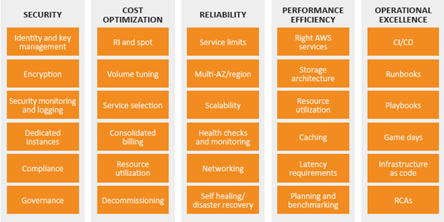

# **AWS Well-Architected Framework (WAF)**

## Introduction

The AWS Well-Architected Framework helps you understand the pros and cons of decisions you make while building systems on AWS. By using the Framework you will learn architectural best practices for designing and operating reliable, secure, efficient, and cost-effective systems in the cloud.

## **AWS Well-Architected Framework Pillars**

### Operational Excellence Pillar

Keep things running and react appropriately to unusual events.

### Security Pillar

Protect the confidentiality, integrity, and availability of the information kept in AWS.

### Reliability Pillar

Similar to the "availability" portion of security, but this is about being resistant to unexpected events rather than deliberate attacks.

### Performance Efficiency Pillar

Use resources with as little waste as practical.

### Cost Optimization Pillar

Find the lowest cost solution which meets the business needs.

## Definitions

### component

A collection of AWS resources that work together to fulfil a particular need. Often used as a collection of tightly coupled items within a much larger collection of loosely coupled components.

### workload

A loosely coupled group of components that fulfil some buiness role.

### milestones

**Beware the waterfall model!** These can mark more significant changes made to the architecture, but if we get continuous delivery going these should either be extremely common or absent.

### architecture

How all the components work together and interact to produce the desired workload.

### technology portfolio

A grouping of multiple workloads.

## Trade-offs

### Fast

This usually refers to the speed of development and implementation. More planning and/or more iterations let optimizations for performance and cost happen so when more time is taken the architecture can improve.

### Cheap

Often components with lower reliability are cheaper. Costs can also be lower if we can accept a poor response time by overcommitting resources.

### Good

Often this means "reliable" or "not too expensive to operate" but can also reflect on the ultimate end-user experience. As usual, if we spend more time and money on a highly redundant, well-scaled workload it will be higher quality.

## Architecture group

"At AWS, we prefer to distribute capabilities into teams rather than having a centralized team with design capability."

## General design principles

### Stop guessing your capacity needs

I'm impressed that this is the first one listed since "premature optimization" is such a common issue, and has been for decades. Rather than guess about capacity needs, **measure them**. Start small and scale up as needed.

In order to determine "need" we will need good measurements of actual end-user experiences (and not just system level metrics, which are at best a loose proxy for the end user experience. At worst, they're completely decoupled from that experience.)

### Test systems at production scale

The flexibility of AWS makes this possible. With apropriate automation it becomes not only possible, but trivial.

### Automate to make architectural experimentation easier

What was I saying about automation? This enables safety features like "revert back" as well as reducing small errors that appear when changes are made by hand.

### Allow for evolutionary architectures

Basically, the above automation can allow for more, smaller changes vs. fewer, larger changes.

### Drive architectures using data

Use science to measure and adjust instead of taking a blind guess.

### Improve through game days

This might be something good to combine with Value Stream Mapping to see how long it takes us to react to and complete common tasks.

## [AWS Operational Excellence](https://docs.aws.amazon.com/wellarchitected/latest/operational-excellence-pillar/wellarchitected-operational-excellence-pillar.pdf#welcome)

### Perform operations as code

**AMEN, BROTHER AWS!** This is completely appropriate as the first thing listed as this can enable so many other good behaviors.

### Annotate documentation

This seems to be a nod to the difficulties with keeping documentation up-to-date. I agree that documentation should be something that the end-users can easily update. I'm not sure I completely agree with the specifics of "automatically annotate documentation", but it's also possible that I misunderstand what they mean. This will be something to keep an eye on as I learn more.

### Make frequent, small, reversible changes

Agreed! It's much easier to undo a small change than a large one. Those tend to be effectively irreversible, which substantially increases the risk of outages or other unwanted behaviors that require a large, immediate effort to mitigate.

### Refine operations procedures frequently

Yes! The feedback loop from operations back to the creators of an architecture is one of the most neglected yet most important. If the "documented procedures" aren't being followed, find out what is being used instead rather than attempting to force compliance.

### Anticipate failure

Most of the time there are enough real failures that creating false ones is overkill. Perhaps someday we'll get things so stable that we end up needing something like the Netflix Chaos Monkey.

### Learn from all operational failures

Avoid blame and encourage transparency. Assume the best intentions of workers.

## Best practices for Operational Excellence: Prepare, Operate, Evolve

### Prepare

This can involve using common, well-documented standards that are prepared in advance. (Ideally implemented from coded descriptions rather than human action.) However, they also caution "Implement the minimum number of architecture standards for your workloads." in order to ensure that the few standards that are present will be followed.

Workloads are designed with methods to measure and monitor the behavior of the business applications and their effects on the infrastructure.

The end-user (customer) experience is also measured and included in ongoing evaluation.

Verify that changes are ready for production through the use of (automated!) checklists against the defined standards. This includes documentation checks. (`awspec`?)

Test failures or other issues in the pre-prod testing area. (That might be a good place to let the Chaos Monkey go nuts even if we're not ready for prod testing to that degree.)

CloudFormation as a way to set up the **same workload** in multiple different locations for both testing and (finally) production.

Operational data collected using CloudTrail, VPC Flow Logs, or OS agents (`collectd`.) Analyzed/checked using CloudWatch.

### Operate

"Define expected outcomes" is great advice, but if the customer is unhappy and "expected outcomes" are being met, it may be worth a re-evaluation. This is not necessarily free of charge, but our goal is client satisfaction and that can be acccomplished by meeting expectations. When that's not happening there are pretty much two options:

1. Achieve better results OR
2. Adjust expectations

"Ensure that if an alert is raised in response to an event,
there is an associated process to be executed, with a specifically identified owner."

"AWS provides workload insights through logging capabilities including Amazon Web Services AWS Well-Architected Framework
AWS X-Ray, CloudWatch, CloudTrail, and VPC Flow Logs enabling the identification of workload issues in support of root cause analysis and remediation."

"Manual processes for deployments, release management, changes, and rollbacks should be avoided."

"Align metrics to business needs so that responses are effective at maintaining business continuity."

### Evolve

"Dedicate work cycles to making continuous incremental improvements."

This is a nice way of saying that we need to **MAKE TIME** for constant improvement. My general rule of thumb is a **MINIMUM** of 2 hours per week for some sort of strategic improvement and in almost every case 4 hours per week will give a better outcome. This means the following:

1. During that time someone else must handle interruptions, this can be managed within a team by alternating times of coverage and strategic improvement between team members.
2. There will be some (possibly important) short term work that does not get done due to the above longer term time investment. Pick the least impactful items, drop/defer them, and don't look back.

"Include feedback loops within your procedures to rapidly identify areas for improvement and capture learnings from the execution of operations."

Hmmm... sounds like a counter to my earlier rant about the lack of feedback from operations back into the design.

"Share lessons learned across teams to share the benefits of those lessons."

Yes! Writing things down is a good first step, and one that is worth doing even if nobody else reads it. (Possible case in point right here!)

"The AWS service that is essential to Operational Excellence is AWS CloudFormation, which you can use to create templates based on best practices."

References:

* [DevOps and AWS](https://aws.amazon.com/devops/)
* [Operational Excellence Pillar](https://docs.aws.amazon.com/wellarchitected/latest/operational-excellence-pillar/wellarchitected-operational-excellence-pillar.pdf#welcome)

## [Security](https://docs.aws.amazon.com/wellarchitected/latest/framework/wellarchitected-framework.pdf#security)

### Implement a strong identity foundation

If we don't know who exactly people are, there's no way to know who did what and no way to keep people out of resources they don't need to be in. This includes special care with "role" accounts that aren't associated with a person. There should be no way for a person to ever use role account credentials and any such attempts should be quickly detected and acted upon appropriately.

### Enable traceability

In addition to alerting, having good audit logs available to assist in manual investigations is very important. Where possible automatic actions should be configured, but use caution not to sacrifice availability for confidentiality or your security responses could be used against you as an attack vector.

### Apply security at all layers

The "hard exterior" approach is incompatible with modern uses of computing resources. Instead, create multiple softer boundaries.

### Automate security best practices

This includes automated checks for security configurations and automatic implementations using Infrastructure as Code methods.

### Protect data in transit and at rest

Classify data and use encryption and tokenization as needed to keep data safe. Tokenization is especially important for HIPPA and GPDR to anonymize personal information.

### Keep people away from data

This helps with both confidentiality and integrity. By having an automated, version-controlled method for working with data a clear record of what happened when is kept, often with the ability to revert back. The only human error will be when changes are introduced into the automated systems, which provides an opportunity for automated sanity checks and/or peer reviews as appropriate. Those checks can prevent the human errors from actually reaching the data and causing permanent harm.

### Prepare for security events

Running reaction exercises is a good plan given how infrequently security events actually happen. Ones that track and record the human responses are especially good since those can identify specific people who might need extra training or experience. (e.g. phishing E-mail tests.)

## Best Practices for Security: Identity and Access Management, Detective Controls, Infrastructure Protection, Data Protection, and Incident Response

### Identity and Access Management

Define principals (users, roles, groups, and services) and assemble them in an org-appropriate way. Assign policies to the appropriate principals (avoid direct assignment to users) using the principle of least-privilege.

Programmatic access (API calls) should use temporary limited-privilege credentials like those from [AWS Security Token Service.](https://docs.aws.amazon.com/IAM/latest/UserGuide/id_credentials_temp.html).

#### Role vs. User

Based on the [AWS Identity and Access Management User Guide](https://docs.aws.amazon.com/IAM/latest/UserGuide/id.html) a role is like a user except a role has no way to log in (no credentials) and instead is assumed by a user temporarily to perform some specific task.

### Detective Controls

What is a [detective control](https://web.archive.org/web/20190315022007/https://www.investopedia.com/terms/d/detective-control.asp)? They're methods used to find issues with processes themselves, often as a form of a "double check" that two different methods which are supposed to give the same result actually do. For example, checking actual inventory vs. the inventory based on recorded changes.

[Amazon GuardDuty](https://aws.amazon.com/guardduty/) is mentioned, but not a lot of specifics are given on examples of Detective Controls in use.

Other supporting tools for this are AWS CloudTrail, Amazon CloudWatch, and AWS Config.

### Infrastructure Protection

There was some discussion of making "hardened" AMIs, which is great, but seems to skip over the elephant in the room of cloud infrastructure security: the permissions needed to control normal infrastructure changes are exactly the same ones that can be used to destroy it. Leaked AWS credentials frequenly lead to infrastructure destruction or misuse and an awareness of this possibility seems to be important, yet not mentioned here.

Like the detective controls section, there is a lot in here about how we "are able to..." do various things, but nothing about how to do that or what the best practices might be-- a glaring omission from a best practices document.

The supporting tools mentioned for this are Amazon VPC, Amazon CloudFront, AWS Shield (DDoS protection), and Amazon Web Application Firewall.

### Data Protection

They mention versioning as a way to protect data from accidental or malicious changes. I agree-- it's a good plan from a data integrity standpoint. (Less good from a data confidentiality standpoint since accidental releases of confidential info are harder to undo.)

While they mention the importance of data classification, no specifics are given. Tags seem like they would be a really good way to make this process much easier by classifying objects appropriately. It would even be possible to automate the process of exploring the data classification of a number of interconnected objects and finding the most sensitive classification among them. That might help determine if there are unexpected relationships between sensitive and non-sensitive systems or determine if an object has the wrong overall classification. (e.g. if we attach sensitive storage to a non-sensitive VM, that VM might need to be re-classified.)

Amazon Macie sounds a lot like what was just mentioned.

Amazon Key Management Service makes managing keys for encryption simpler.

### Incident Response

The ability to spin up a forensics investigation environment was a nice observation. The cloud environment also lends itself well to quick system imaging via snapshots.

Amazon services mentioned include IAM, CloudFormation, and CloudWatch + AWS Lambda.

### Security Resources

* [AWS Cloud Security](http://aws.amazon.com/security/)
* [AWS Compliance](https://aws.amazon.com/compliance/)
* [AWS Security Blog](http://blogs.aws.amazon.com/security/)
* [Security Pillar](https://d0.awsstatic.com/whitepapers/architecture/AWS-Security-Pillar.pdf)
* [AWS Security Overview](https://d0.awsstatic.com/whitepapers/Security/AWS%20Security%20Whitepaper.pdf)
* [AWS Security Best Practices](https://aws.amazon.com/whitepapers/aws-security-best-practices/)
* [AWS Risk and Compliance](https://d0.awsstatic.com/whitepapers/compliance/AWS_Risk_and_Compliance_Whitepaper.pdf)

## Reliability

This relates to handling unexpected failures and unexpected performance issues.

### Test recovery procedures

It's easier to simulate failures in the cloud to test recovery procedures. This can range from setting up a test environment for specific failures or testing a complete AZ failure.

### Automatically recover from failure

Tie automated changes to the results of monitoring-- but don't forget the notification. Rather than relying on a human response to act, we act and notify and rely on humans to come back and undo it if the decision was incorrect.

### Scale horizontally

This helps avoid single points of failure and reduces the costs of scaling. Sometimes hard to do (database) but still worth considering whenever possible.

### Stop guessing capacity

Measure and adapt instead of trying to view the future.

### Manage change in automation

Rather than managing servers or other infrastructure, manage the automation that changes them. (Infrastructure as Code.)

### Best Practices for Reliability: Foundations, Change Management, and Failure Management

#### Foundations for Reliability

This covers the basics and can include things outside the scope of AWS. For example, be sure that the network connections to AWS have sufficient bandwidth and are monitored for their health. Choose regions that are network-close to the most latency-sensitive consumers.

Ensure the service limits are appropriate-- this includes billing limits though that is not spelled out. If Amazon can't charge you, they're going to suddenly stop your service. AWS Trusted Advisor can help show these limits. AWS Shield provides DDoS protection.

#### Change Management for Reliability

"Being aware of how change affects a system allows you to plan proactively..."

That's true, however, in modern complex environments there's no way to predict the emergent behavior that results from the interactions of all the many parts. Thinking otherwise is to downplay the risks involved in making changes. While one answer is to cease making changes, there is another approach that cloud enables well-- quick reversion to the prior (good) state.

Some of the normal aspects of operation that previously might have required a cumbersome approval process can instead be automated.

AWS CloudTrail and AWS Config can help with tracking changes. Amazon Auto Scaling can help with load or performance related issues, especially when combined with CloudWatch.

#### Failure Management for Reliability

"In any system of reasonable complexity it is expected that failures will occur." That sounds a lot like that "emergent behavior" I was talking about earlier.

"Rather than trying to diagnose and fix a failed resource that is part of your production environment, you can replace it with a new one and carry out the analysis on the failed resource out of band." That's a good point, and even the analysis is somewhat optional unless it becomes a regular problem. This does require the ability to create the same server in a repeatable way. (Infrastructure as Code again.)

Backups must be able to protect from both loss of infrastructure as well as bugs or other errors that damage data through software.

AWS CloudFormation helps create the ability to quickly bring up additional or replacement resources. Amazon S3 is useful for backups, and Glacier is useful for archived backups.

## Performance Efficiency

### Democratize advanced technologies

Sounds like Amazon marketing their expensive services... transcoding, machine learning, etc.

"We built all this for Netflix anyhow, maybe you can use it too?"

### Go global in minutes

This is indeed one of the nice things about cloud-- get a global presence without having to build and maintain a data center in multiple spots.

### Use serverless architectures

"storage services can act as static websites" things like this are good to keep in mind. The trick is either building or migrating traditional server-based applications to make use of it.

### Experiment more often

### Mechanical sympathy

### Best Practices for Performance Efficiency: Selection, Review, Monitoring, Tradeoffs

#### Performance Efficiency: Selection

#### Performance Efficiency: Review

#### Performance Efficiency: Monitoring

#### Performance Efficiency: Tradeoffs

## TODO: Finish Performance Efficiency and Cost Optimization once I learn Azure better

There is a strong short-term need for Azure support in CloudOps.

## [AWS Well-Architected Tool](https://aws.amazon.com/well-architected-tool/)

Checks an existing workload for known design issues.

## Conclusion

The AWS Well-Architected Framework provides architectural best practices across the five pillars for designing and operating reliable, secure, efficient, and cost-effective systems in the cloud. The Framework provides a set of questions that allows you to review an existing or proposed architecture. It also provides a set of AWS best practices for each pillar. Using the Framework in your architecture will help you produce stable and efficient systems, which allow you to focus on your functional requirements. 
