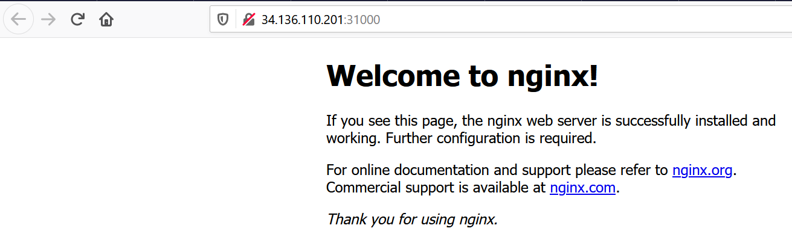

# **Installing Kubernetes cluster on Azure Cloud VM's**

In this we are going to install kubernetes on any of the Cloud platforms and will deploy pod & expose services to outside network. You can use the [AzureCLI](https://github.com/asivaramanr/VisualStudio/tree/master/AzureCLI), if you are using Azure as a platform & [Ansible](https://github.com/asivaramanr/VisualStudio/tree/master/Yaml/Ansible/Kubernetes_Install) scripts from my github  to install & configure kubernetes on nodes.

## Prerequisites:

1. A Kubernetes master node with mininum of 2vCPU and 4GB Memory.

    1. Passwordless authentication from master to all the worker nodes as root. (Remember to enble root login to yes in sshd_config).

2.  Two or Three worker nodes with at least 2 vCPUs and 8GB RAM each. 


3.  Ansible installed on master. For installation instructions, follow the official [Ansible installation documentation](https://docs.ansible.com/ansible/latest/installation_guide/intro_installation.html).

    1. Update the /etc/hosts file on all servers:
    ```
    10.1.0.4 debian1 master
    10.1.0.5 debian2 worker1
    10.1.0.6 debian3 worker2
    ```

## Step 1 — Setting Up the Workspace Directory and Ansible Inventory File as root user:

This will be on the master node we just created. 

```
mkdir ~/kube-cluster ; cd ~/kube-cluster
```
This directory will be our workspace and will contain all of our Ansible playbooks. It will also be the directory inside which you will run local commands.

Create a file named `~/kube-cluster/hosts` using nano or your favorite text editor and update below:

```
[masters]
master ansible_host=10.1.0.4 ansible_user=root

[workers]
worker1 ansible_host=10.1.0.5 ansible_user=root
worker2 ansible_host=10.1.0.6 ansible_user=root

[all:vars]
ansible_python_interpreter=/usr/bin/python3
```
## Step 2 — Creating a Non-Root User (ansible) on All Remote Servers:

```
ansible-playbook -i hosts ~/kube-cluster/user_creation_initial.yml
```
## Step 3 — Installing Kubernetes Dependencies:

```
ansible-playbook -i hosts ~/kube-cluster/kube_dependencies_install.yml
```
(Current version of k8s is 1.21.0-00 change it as required)

After execution, Docker, kubeadm, and kubelet will be installed on all of the remote servers. kubectl is not a required component and is only needed for executing cluster commands. 

## Step 4 — Setting Up the Master Node:

```
ansible-playbook -i hosts ~/kube-cluster/master_initial.yml 
```

Once inside the master node as **ansible** user , execute below command:

```
kubectl get nodes
```
Output: 
```
ansible@debian1:~$ kubectl get nodes
NAME      STATUS   ROLES                  AGE   VERSION
debian1   Ready    control-plane,master   20m   v1.21.0
ansible@debian1:~$
```
## Step 5 — Setting Up the Worker Nodes:

!!! important
    Switch back to root account from ansible to completed the final step of installation.

```
ansible-playbook -i hosts ~/kube-cluster/join_worker_nodes.yml
```
## Step 6 — Verifying the Cluster:

Now onwards we will use only ansible account for creating deployments and services.

```
kubectl get nodes
```

Output:
```
ansible@debian1:~$ kubectl get nodes
NAME      STATUS   ROLES                  AGE   VERSION
debian1   Ready    control-plane,master   24m   v1.21.0
debian2   Ready    <none>                 81s   v1.21.0
debian3   Ready    <none>                 81s   v1.21.0
ansible@debian1:~$
```
If all of your nodes have the value Ready for STATUS, it means that they’re part of the cluster and ready to run workloads.

!!! success
    You have successfully set up a Kubernetes cluster with Ansible.

## Step 7 — Deploying Application on the Cluster:

Deployment scripts are [here](https://github.com/asivaramanr/VisualStudio/tree/master/Yaml/Ansible/Kubernetes).

### Deployment

!!! note
    All the kubectl commands should be executed as non-root user (ansible) we created initially.

```
kubectl create -f nginx-deploy.yml
```
A deployment is a type of Kubernetes object that ensures there’s always a specified number of pods running based on a defined template, even if the pod crashes during the cluster’s lifetime. The deployment will create a pod with one container from the Docker registry’s Nginx Docker Image.

```
kubectl get deployment -l app=nginx-app
```
```
ansible@master:~$ kubectl get deployment -l app=nginx-app
NAME               READY   UP-TO-DATE   AVAILABLE   AGE
nginx-deployment   3/3     3            3           45m
ansible@master:~$
```

### Services

Services are another type of Kubernetes object that expose cluster internal services to clients, both internal and external. They are also capable of load balancing requests to multiple pods, and are an integral component in Kubernetes, frequently interacting with other components.

Next, run the following command to create a service named nginx-service that will expose the app to Public IP. It will do so through a NodePort, a scheme that will make the pod accessible through an arbitrary port on a worker public IP:

```
kubectl create -f nginx-service-np.yml
```
Output:
```
ansible@master:~$ kubectl get service -l app=nginx-app
NAME               TYPE       CLUSTER-IP      EXTERNAL-IP   PORT(S)        AGE
nginx-service-np   NodePort   10.104.48.148   <none>        80:31000/TCP   4m27s
ansible@master:~$
```
## To test that everything is working:

Check on which worker node the pods are running
```
kubectl get pods --output=wide
```

```
ansible@master:~$  kubectl get pods --output=wide
NAME                               READY   STATUS    RESTARTS   AGE    IP               NODE      NOMINATED NODE   READINESS GATES
nginx-deployment-8bc69dc67-c62t7   1/1     Running   0          120m   10.244.235.131   worker1   <none>           <none>
nginx-deployment-8bc69dc67-crjbd   1/1     Running   0          120m   10.244.189.66    worker2   <none>           <none>
nginx-deployment-8bc69dc67-frsv5   1/1     Running   0          111m   10.244.189.67    worker2   <none>           <none>
ansible@master:~$
```


### Now you can use the public IP of worker node with port 31000 to get the default nginx page.





## Cleanup the resources .

### If you would like to remove the Nginx application, first delete the nginx service from the master node:
```
kubectl delete -f nginx-service-np.yml
```
### Run the following to ensure that the service has been deleted:
```
kubectl get services
```
Output:

```
ansible@debian1:~$ kubectl get services
NAME         TYPE        CLUSTER-IP   EXTERNAL-IP   PORT(S)   AGE
kubernetes   ClusterIP   10.96.0.1    <none>        443/TCP   38m
ansible@debian1:~$
```
### Then delete the deployment:
```
kubectl delete -f nginx-deploy.yml
```
### Run the `kubectl get services` again to confirm it worked:

Output:
```
"ansible@debian1:~$ kubectl get deployments
No resources found in default namespace.
ansible@debian1:~$"
```

### To delete all the resources created in Azure 

 If you used the scripts. We created all the resources in one single Resource Group. By deleting the RG,  all the resources created inside the RG will be deleted.
 
 Use `Azure_delete_resourcegroup.ps1 from` [AzureCLI](https://github.com/asivaramanr/VisualStudio/tree/master/AzureCLI)